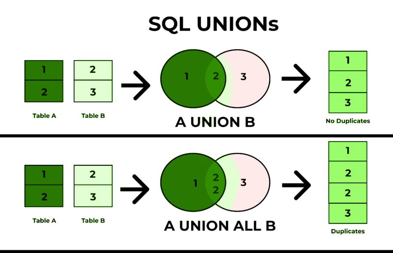

# Union e Union All

### Union -> Combinado resultados de queries e remove duplicatas

```javascript
SELECT 7 UNION SELECT 4;
SELECT 3 UNION SELECT 3;
```

### Union all -> Combina resultados de queries mantendo duplicatas

```javascript
SELECT 7 UNION ALL SELECT 4;
SELECT 5 UNION ALL SELECT 5;
```

> Uma regra importante:
> O resultado das consultas precisam ter a
> mesma qtde de colunas e tipos compatíveis.